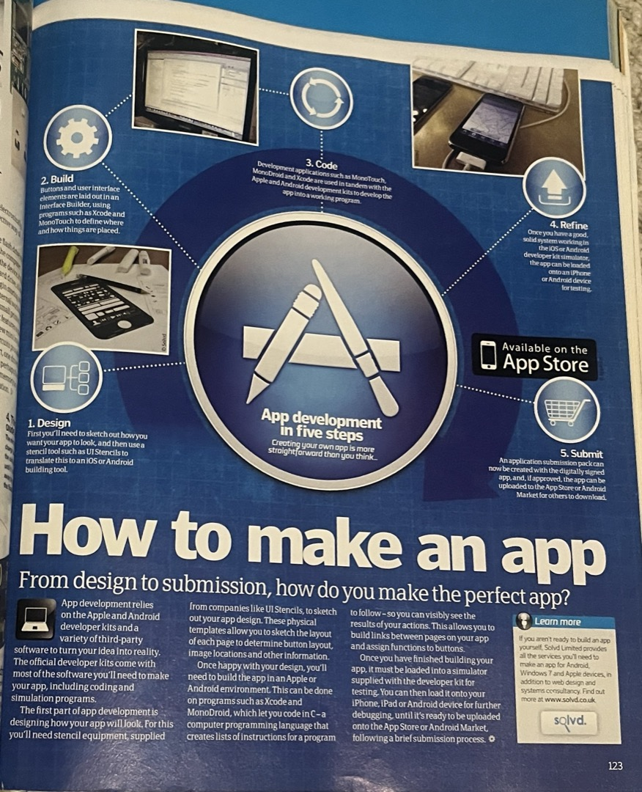
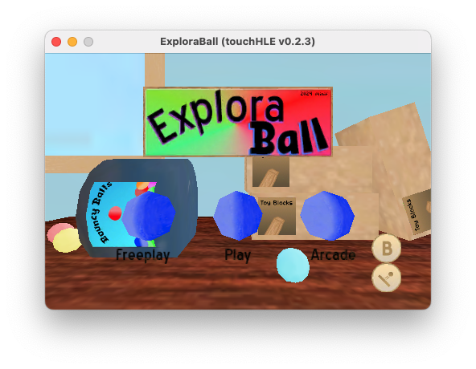

It is 2011, and you are a kid in a bookstore. You are looking in the magazine isle for something to keep you occupied for the car ride. After a bit of looking, one particular magazine catches your eye. 


It was a bit expensive, costing about 25 dollars. But after looking around more, and promising your parents you were going to read it lots, you get to bring it home. Little did you know that this one magazine was going to shape so many of your interests for years to come.


Whole pages are dedicated to explain any technology you could think of. Things like roller coasters, electric guitars, cameras, computer networks DVDs and so many more. You learn what the iPhone is. What USB is. What QR codes do. Oh, and one other thing that you read:



With how cool the iPhone 4 seems, wouldn't be fun to make your own apps for it? I mean, the steps look pretty easy. You just got to sketch out your ideas for it, then build and code it, and then publish it on the App Store. But alas, "then build and code it" was not that simple. I mean, what do you even do? You don't even know what code is, outside of maybe the couple of projects you made using scratch. Alas, as fun as the idea seems, you accept that you aren't able to do this. You turn the page and then read about 4G networking instead.

---

Hello! I finally have the time to write about when I made [Explora-ball](https://github.com/minif/Explora-Ball), which is a mobile game I made for old iOS devices about a year and a half ago. I will basically be a retelling of the process of making this game, as well as maybe sharing some other facts about the development. This blogpost is was one of the things I have been wanting to make for the longest time now, but unfortunately I did not have a blog at the time. This week I have a bit of downtime and so I can finally put time aside to get this off my plate. Since it has been a while some of the details will be a bit hazy, and I will have to do my best to remember what I did. I was good at keeping snapshots of my development but I never really wrote devlogs or anything talking about my thinking behind the project. Well, other than maybe a couple of Discord messages I made in a few servers showcasing the project, and others troubleshooting issues I had. Hopefully however I can do my best to recall everything.

It is important to note that my first foray into iOS app development wasn't Explora-Ball. I think sometime in 2017 I downloaded Xcode for the first time ever with the hopes to finally make games and apps for iOS. However, as much as I wanted to learn, nothing I could read online really stuck with me. I would search Google for "how to make iOS game" posts and would follow the examples (usually explaining how to use SpriteKit), without actually getting much out of it. I think my issue was that I was diving a bit into the deep end with things. My programming knowledge at this time was really only Scratch, and HTML + Really Basic JavaScript. I don't think I had yet touched C yet or really understood concepts beyond programming basics. I also don't think I really knew how to teach myself properly. 

That isn't to say that I didn't make iOS apps. However, the apps I did make consisted of taking things I made using JavaScript and putting it in a web wrapper. I made an iOS app version of my personal website at the time (which doesn't really make much sense coming to think about it - what happens if I updated my website? Note that the web wrapper loaded locally stored HTML files). I also took a game called "Pick a Number" and turned it into a web wrapper app. This game was basically a demonstration of binary search to guess a number out of 100 in 7 tries. While these were for sure iOS apps I was making, I knew that this wasn't really what I was after. I knew I needed to learn Swift or Objective-C to really make something I was proud of. 

The whole "Website wrapper" iOS app idea was abandoned, partially because it was more web programming and partially because iOS development turned out to be a bit troublesome. This is due to the infamous limitation that Apple places on developer-signed apps. With a free account, you are limited to running your app for 7 days. After that point, the app would no longer open and you could no longer test your app. The idea was that this should get you to purchase the $100 yearly fee to become a full Apple Developer, and then publish your app to the app store. But I can not justify $100 a year to make simple little apps. At the time, I was unaware of Jailbreaking (I really regret not getting into it sooner), which could have bypassed this 7 day restriction. Also, around this time, I was introduced to Super Mario World rom hacking which was a lot more interesting, so I promptly abandoned the desire to make iOS apps for the time being.

Many years passed from then. I took actual computer science and software engineering classes, which finally gave me a real understanding with programming and how computers work. Around 2021, I was finally introduced into the world of Jailbreaking, and then eventually the world of iOS app archival and older iOS games. It was driven by nostalgia of using my iPod Touch 5th gen between 2013-2015, but getting around some of the brokenness of using a 10 year old electronic device. I also got to see the launch of probably one of my personal favorite emulation projects, called TouchHLE, which finally brought a way to make old iOS games playable on modern computers. 

But really, the catalyst of me finally fulfilling my desire to make an iOS app was coming across the Stanford "iPhone Application Development" class recordings, staring out with [19. OpenGL ES](https://www.youtube.com/watch?v=_WcMe4Yj0NM). Unfortunately I do not remember exactly how I came across this video. I think what lead up to this was watching some of the technical explanations on how touchHLE worked, thinking "this is probably a good time to finally figure out old iOS development" and started searching for old material iOS app development lessions. What I do know is that I watched this video a few times, along with the first 6 or so videos in the series, and actually took notes like it was a class I was attending. I believe this was honestly a great way to learn, I guess you could say I was able to `[information retain]`.

(im sorry)

Side note: I want to go out and say that I actually really like Objective-c. The internet lead me to believe that it was a terrible language but I found it was quite the opposite. After getting over the shock of methods being called by square brackets, I actually kind of enjoy the syntax. Honestly I don't really see myself learning Swift anytime soon, Objective-c does what I need.

As for what game I wanted to make, my initial idea for the game started out very different to what I ended up doing. The premise was going to be that a gumball was vended out of one of those big candy machines with a corkscrew chute, that then rolled onto the ground and into a bunch of levels (which to be honest I still think is an interesting premise for the game). Each level you would need to drag parts onto the stage to let the ball pass. I think this idea was based off of a really old flash game I played called "Design It! Build It! Fidgit!" that had a similar idea of using parts to complete a level. I realized really early on that this idea was a bit too much for me to do, being my first time ever doing 3D graphics. So I settled on a different idea:

The inspiration that I went with was from a different iOS game I remember back in the day, called "Cash Cow". It was a take on the "match 3" concept where you had to match coins to make coins of a higher value, or a whole dollar. Think "2 5 cents for a 10 cent, two 10 cents and a 5 cent for a 25 cent." Although, it was not actually this mode that my inspiration came from. Every couple levels there was a bonus level where you had four coins, and you used the accelerometer to get the coins into the bucket. There were 10 of these levels, and each one had different interesting moving objects to help or hinder your progress. What was interesting about this mode was that all four coins were affected by the tilt of the device, so you had to plan out how to keep the other coins safe as you got one across a tricky jump. Aside from playing the main game, there is a mode to also play all these bonus levels at once, and if you missed a coin it was gone from later levels. You lose by having all four of your coins fall off the screen, and win by completing all stages, with your score being based how fast you completed all the stages and how many coins got to the end.

The one thing I wanted to do differently was give back balls once every few stages. That way, the game could have many different levels, without feeling too hard or being stuck with one ball for the majority of the game. Also yes, I wanted to keep the ball idea, as it made sense as an easy thing to make. I loved the farm art backgrounds of Cash Cow but I wanted to make 3D modeled backgrounds for my game. 

So now that I had an idea for my game, it was finally start to make something! My goal was to make it using the original iPhone OS 2 SDK, so that I could develop for the original iPhone and iPod Touch. I also wanted to make it compatible with TouchHLE, which does not yet have full compatibility with iPhone OS 2 produced apps yet so sticking to an old SDK was my best chance of success. 

The thing I realized was going to be the "make or break" of this project was the physics. I had two options: off the shelf or make it myself. When learning and testing out the performance, I had a bug (if I recall correctly, I was calling `glGenRenderbuffersOES(1, &depthRenderbuffer);` every frame rather than in my init code) that caused me to underestimate the performance of old iOS devices. So I worried that an off the shelf solution would cause too much performance loss. My goal was to target 60FPS on all devices. I also felt the game would be more personal if I made my own physics engine.

Creating the physics engine was definitely the least fun part, although it was satisfying to get working. I had decided to do it in C++ rather than Objective C because I was more familiar with it. I also used sfml for the graphics library before (or while?) learning OpenGL because it was easy to work with. The idea that I went with was to start with circle-circle collision, and then to "fit the square into the circle hole"

```void Square::setColisionCenter(double& xcol, double& ycol, double& colDistance, double xother, double yother) {
	//First, translate and rotate other point relative to center of this rotation
	xother-=x;
	yother-=y;
	
	double xprime = xother*cos(-rotation*(3.1415926535/180))-yother*sin(-rotation*(3.1415926535/180));
	double yprime = xother*sin(-rotation*(3.1415926535/180))+yother*cos(-rotation*(3.1415926535/180));
	
	//Now do bounds check
	/*
	if (xprime>-width/2&&xprime<width/2) { //in line vertical
		cout << "In line vertical " << xprime << "+-" << width/2 << endl;
		yprime = 0;
		colDistance = height/2;
	} else if (yprime>-height/2&&yprime<height/2) {//in line horizontal
		cout << "In line horizontal " << yprime << "+-" << height/2 << endl;
		xprime = 0; 
		colDistance = width/2;
	} else {
		xprime=0;
		yprime=0;
		colDistance = 0;
	}
	*/
	xprime = clamp(xprime, -width/2, width/2);
	yprime = clamp(yprime, -height/2, height/2);
	colDistance = 0;
	
	//Rotate and translate xcol and ycol back
	xcol = xprime*cos(rotation*(3.1415926535/180))-yprime*sin(rotation*(3.1415926535/180));
	ycol = xprime*sin(rotation*(3.1415926535/180))+yprime*cos(rotation*(3.1415926535/180));
	
	xcol+=x;
	ycol+=y;
}
```

Yeah it was an interesting idea. But it did work, and it is in the final game. The circle just got the xcol and ycol as the x and y of the circle, and the colDistance as the radius. Then the simulation would check the distance using the x and y coords was smaller than the sum of the two distances. I took this idea and came up with this code to account for the circle->rectangle case as well. The video that I watched demonstrating this case showed the position of the circle being clamped to the bounds of the rectangle, and then the distance from this clamped point is found to the middle of the circle and checked to the radius. The better way of course was to implement Separating Axis Theorem but janky solutions were more fun.


I unfortunately do not remember what went wrong under the hood with this prototype physics attempt. After collision detection I had a system where the object pushed the object it was colliding with, and then it would then push back if up against a wall. Somehow this went wrong and ended up with objects bouncing following the [perimeter of each other](https://www.youtube.com/watch?v=SMz5cVg5B24) rather than properly pushing. I decided to restart the collision resolutions with a new prototype. I think I decided to have a separate collision resolution for immovable objects that would not respond to pushing and would force push other objects. And this time it worked okay! I remember the balls "sticking" to the ground after adding gravity, so I added a hack where if the velocity is too small the bounce reduction would not apply (so a ball bouncing on the ground will continuously bounce 0.01 units forever). That is honestly the most fun part of game design, it doesn't have to be right, it just has to look right. Later on there was some other physics issues I encountered but I just never let them happen in level design.


So now the physics engine was working, and I could actually make an iOS app! I basically started out by bringing over the physics engine I worked on over to Xcode. I created the OpenGL ES template project which uses an EAGLView.m file to setup and render an OpenGL ES example. This EAGLView.m (later .mm) became the main game file, a lot like a main.c or main.cpp file. I created an Objective-C wrapper for the physics objects (one wrapper for both circles and rectangles) and a wrapper for the physics simulation object. The wrappers were basically there to house the c++ objects, have getters and setters for them, and importantly draw them. The goal of the first build was really just see if the prototype I made in c++ could be brought over to iOS. In terms of drawing I just took the default square drawn, and transformed it to match the size and rotation of the physics shapes. The wrappers were then put into EAGLView to be updated each call of `drawView`. Tilt was done by setting up the accelerometer and setting up `didAccelerate` to send the y acceleration to the simulation wrapper.


(Note that the grey square beside the little coloured square is not part of the app, that is just the touchHLE virtual touch indicator.)

At this point, the project was finally real. I sent this screenshot to a couple of discord servers I am in to show people that I was making something, and after this day I worked basically every single day for the next couple of weeks. The first thing I implemented was the actual ball 3D models. As it was something simple, I opted to do the modeling in spreadsheet software, which sounds funny when writing but it had the benefit of being precise with placing points. In the end I achieved a bunch of 3D balls, along with 3D rectangles instead of 2D ones.


The following days, I started to go through the usual game development process. I started to figure out how level loading works, how "goal" objects are added to the game (they are actually rectangles, not added to the physics simulation but checked for collision), and started adding textures. In this regard, I decided to go with "PVRTC" textures. This is a special texture format, specifically designed for PowerVR GPUs that are found in old iOS devices. The main benefit of them was that they are extremely small compared to storing the textures as PNG or in uncompressed formats. The downsides, which I did not really know at the time, was that the compression makes text look really bad, to the point of being unreadable at times. One thing I was aiming for was bare minimum filesize, as the idea of having a game that was only a few megabytes was interesting. In the future, I may decide to replace all PVRTC textures with PNG and then use Core Graphics to convert them into textures to load. 

The level format I decided to settle with was to use Apple's .plist, really because it was built into Xcode and super easy to use, and felt right at home for an iOS app. The structure was to have a big array of all the level objects, and a dictionary for level properties. Implementing the level loading was also one of the many times where I had to implement "touchHLE hacks" because getting doubles from plists was not implemented yet. Instead, I had to find features that were implemented to do the same thing. This lead to the following code:

```double convertNumberToDouble (NSNumber* num) {
	//As of TouchHLE v0.2.2, the way to get a number from an NSNumber was not implemented. Therefore, 
	//This convoluted function gets a number for us. 
	//The downside is that it can only get an integer because scanf cannot get floats or doubles yet.
	//This will be kept in version 1.0 of this game, but will be deprecated for 1.1 (#define will be switched off and forgotten)
	double val;
	NSString* n = [num description];
	char nCString[128];
	[n getCString:nCString maxLength:128 encoding:NSUTF8StringEncoding];
	if ([n isEqualToString:@"0"]) {
		val = 0; //For some reason a 0 string crashes?
	} else {
		int wholePart;
		sscanf(nCString, "%i", &wholePart);
		val = wholePart; //We don't really care about the decimals, the scale involves whole numbers
	}
	return val;
}
```


The next thing I worked on was turning the goal into a bit more of a proper object. I first created an animation when the balls touch the goal zone, where the balls are sucked into the middle before removing the balls. This actually turned out to be a cool effect because it basically just forced movement of the balls in the x axis while still respecting ball collision, so when the ball feels like it is guided in rather than being forced in. With that done I implemented a special level loading feature that involves a collection of boxes to be loaded into the physics engine and not rendered, and to instead show a custom model at the specified position. This is what allowed me to have a bucket object to serve as the goal for balls to go into. 

To implement this feature, I had to finally add a proper 3D model file format, rather than just encoding vertices into arrays. My solution was to just make the vertex array into a file rather than hardcoded, and then load the file into an array and use like I have before. I gave these files the extention .bin. The texture coordinate array is a separate file that is otherwise the exact same idea, being an array saved as a file. I called these files .binmap. To get these, I 3D model in Blender, export them as triangulated .obj, and then use a janky python script to read the .obj and export them as my desired file formats. Then, the level .plist would point to the .bin and .bimmap files and then load them. 

And that brings me to 3D modeling. Before this project, I have only dabbled in 3D modeling before. My original experience was being registered for a summer camp as a kid that was 3D game design, where we used Blender to both 3D model as well as make video games (Blender had a whole mini game engine in the past, it was kind of interesting). After that, I continued on and made a couple of games on my own time in the same mannor, and then stopped altogether. After that, I only really touched Blender for the odd 3D model I needed to make. When jumping back into Blender for this project, I was surprisingly familiar with 3D modeling, and I only really needed to learn UV unwrapping and editing which was easy to learn. I should note that I decided to use Blender 2.6, as I wanted to stick with using older software as well as wanting to take advantage of familiarity with it. The bucket texture was the first model in this project that I modeled, textured, and then imported into the game. 

On a roll with blender, the next thing I wanted to implement was backgrounds! My idea for these was to take an opposite approach to the game that I was inspired by, and have 3D backgrounds that move as you complete levels. I decided I was going to have each background represent a different "world" with a unique level gimmick, that I slowly introduce as the game progresses. As for what I decided to implement for backgrounds, I kind of just went with random ideas. 

I decided to make the first world a "garden" world. I was inspired by the trellis that I grew up seeing in our backyard, and I wanted to include small flowers based off of pictures I have taken. To do this, I actually took those very pictures and extracted bits of them, and then tried my best to 3D model the plant and then put their textures on them. I only really did this for two of them, the others I just made little circles and put texture on them. The bush was made to not model in proper dirt and then I had the idea for a grass hill as well. While this was probably the worst looking background it is probably the most personal of them.


In this screenshot, the background was not final! The flowers I mentioned that I had modeled are not in it yet, but that will be in future screenshots. You may notice the flower I included is actually my Discord profile picture. That picture in particular is one of my favorites that I took in 2018 which is why I set it as my Discord profile picture and then never change it again.

The next background I decided to implement was a "factory" world. My inspiration for this background is a bit obscure, it was based off the final world in the Wii title Crayola: Colorful Journey. This is a game I played ironically that I actually grew to appreciate some (but for sure not all) game mechanics. This was a simple background to make but was pretty nice all things considered. While still kind of basic I do think it is a step up over the previous background I made. I particularly like the conveyor belts, and the brick texture seams were masked pretty well!


As for the technical details for the backgrounds, I decided to store the textures for them on a different texture file from the levels, to make it more flexible to swap backgrounds. The implementation I decided to go for was to use glClientActiveTexture to swap between texture 0 and 1, which I decided to call the FG and BG texture. This is another case of a design decision I made and regretted, because I misunderstood OpenGL at the time. When learning, I learned that glBindTexture was a bit of an expensive call to make. As I wanted to guarantee 60FPS, I decided to go the glClientActiveTexture route because I just load in both textures and switch as needed. To be honest, there is nothing wrong with this method, but it isn't really how I should be doing things. I later learned that glClientActiveTexture is actually meant for multitexturing, which is where you have two or more active textures at once. The issue with this method is that on certain Android GPU vendors, the game (running on touchHLE) has broken textures. It turns out glBindTexture is expensive, but it is normal to call a few times in a frame. The real worry is calling it hundreds of times in a frame for making a different texture for each object.

The next big thing to add is the menu. I think this is probably my favorite one to look back on, as it has come a long way from the random placeholders. This also involved quite a complicated system to do. I created a button class that had parameters for button ID, size, position, UV, etc. Then, I have a bunch of class methods that construct all the menu buttons with the correct information into an NSMutableArray (which to be honest didn't need to be mutable). Then, the game (still mostly managed by EAGLView) has a menu state and renders all the buttons for the active menu state. Touches are handled by EAGLView and the XY of each touch has a collision check to each button, and the button that makes contact has an action deployed. The actions consist of navigating to different menus, toggling a variable, or transitioning into the game. 


Fun fact about this background, it is a picture of the sky I took myself, when getting access to a wide angle iPhone camera for the first time in my life. The background is actually no different to the 3D model backgrounds I made, I just rectangle a square in blender and added the picture as a texture to the rectangle.

At this point, the very basics of the game was done! The next couple of days, I added polish and details, such as a level picker, fading, a win screen, and my favorite detail: the slightly rotating balls on the menu screen that spin when you click them. And after these small additions, I got to the next big part of game creation: level design.

I started very late July just sketching out level ideas. Doing this directly on paper with a pencil is really nice to grind out ideas, because it means I spend less time playing around with with using an editor and more time thinking. I actually found that going outside for a walk around the neighbourhood could let me focus on level ideas better and draw inspiration for levels. In the end I had about 30 or so levels which was perfect to get started with. 


The next part was implementing these levels. I was considering making a level editor, but that was going to be a lot of work for something that I was only going to use a few times. Which lead me to a thought. Why not make a special "touch to reload" build of the game, where I edit the .plist files and then immediately see it in my game? I was originally considering Xcode, but that meant I would have to find where Xcode installed the game to the simulation. So I decided to use the next closest thing: touchHLE! I made a special build of my game that immediately loads and reloads the level, and then edited the .plist file to recreate each one of my sketches. I then transfered over the levels to my Xcode install to add the levels. 

And after a week or so, all the levels were done! I was at the point of finishing up the presentation of the game. My goal was to release a demo with the 30 levels I already made, and get other people to play to get feedback and bug reports.

I made a proper background for the menu, which was supposed to fit the idea of "getting ready to play the game" by being a bunch of boxes of blocks and a bucket (which was the same as the goal in each level) of balls. This one is one of my favorites and turned out really well. I started with a placeholder graphic of the logos, but then eventually redrew them myself. 


After that, I was finishing up the menu assets. I finally called the game "Explora-Ball" (which I am not really consistent on to be honest, I "bounce" between Exploraball, Explora Ball, and Explora-Ball). I created a logo graphic for it, graphics for the menu buttons, menu text, and more. 

The last thing that I implemented was Audio. This was the most annoying thing to do, OpenAL seemed pretty easy in theory but actually kind of difficult to do in practice. I frequently had issues with audio not working or breaking, it took a couple days to get right. The game uses .wav files to store audio and really just consists of menu clicks and sounds for getting balls into the buckets. The .wav loading code is probably the only code in the entire game that I did not write myself, and instead copied it from Stack Overflow. I do plan on fixing this in the future by rewriting as Objective-c.

The audio design is a neat touch I decided to add. Rather than just being a simple "Ball goes into bin" sound I wanted to make a bit of a musical approach by making each successful ball be a different note on a random scale. When each level loads, a random musical scale (or sometimes broken triads) is picked from a list, and then the nth ball that enters the goal bucket plays the nth note in the scale. The first ball plays the note twice, and the last note plays a power chord (my logic for choosing a power chord is that it did not need separate major and minor variants). A detail I specifically added was that I made the E flat minor scale a 1/100 chance. This was because E flat minor is the key of Sacred Somnom Woods/Dreamy Somnom Labyrinth, which are one of my all time favorite video game OSTs.

At this point, the game demo was basically nearing completion! After adding a couple of settings buttons on the title screen, and implementing saving, I was ready to share! I sent out the game to a couple of servers for people to try out. I am glad I did this because right away I received reports of issues and crashes on a bunch of different devices. I want to give a big thank you to everyone who did this, as it was extremely helpful for figuring out things I missed. It was also cool to see people play and enjoy the game I spent lots of time working on. 



As fun as this initial push was, it was nearing a month since I began (July 17th to August 15th, 2024), and I was starting to burn out. I fixed some of the big crashes (which was basically more OpenAL issues, of course) and then took a bit of a break. 

...Well life kind of picked back up and the project stalled for a bit. I would play the game from time to time, and make notes of things to finish up. However, it wasn't until Christmas that I finally found the time to finish up the game.

Development from the demo to the full game was not a whole lot new from before. The biggest push was creating all the levels, and the remaining worlds. I decided on 5 different levels, and continuing the 15 levels per world, meaning 45 new levels needed to be developed. I continued the process of sketching, designing, and adding each level. I added three new gimmicks to correspond to each world, being gravity zones, grow and shrink zones, and portals. All three of these mechanics were implemented by re-using the idea behind goals, but to instead apply effects to the balls instead.

For the first new background, I decided to make an island in the middle of the ocean. This background is inspired by the StreetPass Mii Plaza minigame: Ultimate Angler/Streetpass Fishing, which at the time I was playing a lot of. I actually matched the general idea of the island, having a small fishing village and a single lighthouse on the island. I think this background turned out nice, and it made for easy foreground objects.

The second new background was an office. My idea was to have a computer with the game being designed on it. I decided to model the polycarbonate intel iMac, despite developing the game on a Mac Pro, because I really like the look of the polycarbonate iMacs. The rest of the office was a bit of an afterthought, I added papers, chairs, and desks. I really like this background, but I do not like the foreground I picked. I had trouble thinking of something that didn't blend into the background, so I took the easy way and picked red. This looks really bad and I should have went with a dark wood colour.

The final new background was the night sky. My original goal was to recreate the northern lights, because around this time I was pretty going out to see them. But I realized this was beyond my skill level to model, so I instead went with what I would see when looking the other way: the silhouette of the hills and the power line. This was a simple background to make, but I think it turned out decent. I decided to add randomly generated stars to the background to make it way more interesting. I even made it so the stars slowly move! 

And after adding the new levels, backgrounds, and mechanics, the full game was done! On January 25th, 2025, I released the 1.0 build of the game, as well as the [full source code of the game](https://github.com/minif/Explora-Ball). And that is about where I left it. 

To this day I still feel extremely proud of this project. To be honest, it was kind of a big project considering how little experience I had, but despite that I think it turned out great. Over the past year and a half I play it occasionally and still think it is a fun game. I also am glad to finally understand OpenGL and the basics in 3D graphics. But most importantly it was nice to finally say I satisfied my long-standing goal of wanting to make an iOS app. A real, proper, iOS app. One that, if it was 2009, I would publish to the app store for 99 cents.

Unfortunately it is by no means a perfect game. There are a bunch of things I wish I did differently. Some of them I don't blame myself for not knowing. Some I will actually go fix down the line. My biggest disappoint was not making my own .wav loading code. One goal I had was to release my game under a very permissive licence, to allow for easy distribution. But with the .wav loading code, I cannot confidently say the code belongs to me, and therefore I feel like I cannot licence it. It should be easy to rewrite this code with something else though. The code I cannot rewrite easily is the .pvrtc loading code, which is actually an Apple provided example. This code is licensed under a proprietary apple licence that may restrict what I can ultimately choose. 

Well, that is it for this post. Feel free to play the game using the download link I shared above. Hopefully in the future I can make more apps and games for old iOS devices. And hopefully I have inspired you to also try creating games for old iOS devices; it would be cool to see a homebrew scene on the levels as other video game consoles. 

Thanks for reading! I didn't realize how long that would be. It feels nice to finally get this finally written. And honestly, if you remember nothing else from this, please just remember the importance of creativity and making things yourself. There is no better feeling in the world.

(I am going to publish this and edit later. So if you are reading this, I have not yet done so. Hopefully I did not make too many mistakes with writing this.)